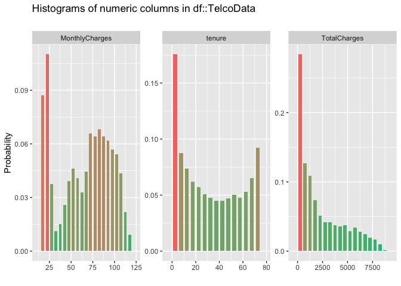

README - Customer Churn Models
================
Martin Frigaard
current version: 2019-11-01

# Motivation

This project is for [Demystify Data Science at
EscapeSF](https://www.bigsquid.com/san-francisco-machine-learning-event-2019).

> Business leaders need to make decisions at the speed of business, and
> yet traditional machine learning projects can take months before they
> ever see the light of day.

> We want you to join us for an afternoon of drinks, food, and an escape
> room with Big Squid machine learning experts and analytics powerhouses
> from Paradigm Data. You’ll hear what it takes to prepare for machine
> learning initiatives, how to efficiently develop and deploy ML
> solutions, and how to democratize data science through your
> organization.

The documentation for this data set is available
[here](https://www.kaggle.com/blastchar/telco-customer-churn) and in the
readme file that comes with the Kaggle dataset.

``` r
fs::dir_tree("data/raw", regex = "dict")
```

    #>  data/raw
    #>  └── data-dictionary.md

## Objectives

We’re looking for a data set with product usage, customer demographics,
and churn rates for the event above. See a description of this project
below,

> “Customer churn, when a customer ends their relationship with a
> business, is one of the most basic factors in determining the revenue
> of a business. You need to know which of your customers are loyal and
> which are at risk of churning, and you need to know the factors that
> affect these decisions from a customer perspective. This code pattern
> explains how to build a machine learning model and use it to predict
> whether a customer is at risk of churning. This is a full data science
> project, and you can use your model findings for prescriptive analysis
> later or for targeted marketing.”

Our objectives with this data set are:

1.  Demonstrate the importance of sufficiently defining the business
    question or problem of interest

2.  Map that question/problem into an analytical framework capable of
    answering it

## Question/problem of interest

The context statement for this data set is, “*Predict behavior to retain
customers. You can analyze all relevant customer data and develop
focused customer retention programs.*”

1.  We can tell that customer retention (or it’s inverse, churn) is the
    *outcome*. What are the behavioral variables?

2.  Were all the data collected/measured at the same time? If not, is
    the time different significant?

Is the customer data current? Was it defined in the same way at each
time point? For example, if a customer indicated they were not a senior
citizen (i.e. `SeniorCitizen` is `0`) at the beginning of their tenure,
but after 60 months they’ve retired and are now living on a fixed
income, this data has changed and no longer captures the measurement
relevant to our business question (i.e. *What behaviors drive customer
churn?*).

3.  What is the level of granularity in this data set?

<!-- end list -->

  - Is arranged by each customer’s monthly bill, so that each
    `customerID` is repeated 12 times per year, with the services listed
    for each month, or

  - Is this an aggregated/summarized data set with a single measure for
    the monthly or quarterly bill?

For example, assume a customer has been receiving services for 45
months. Can we tell if the number of services for that customer has
changed over the course of their `tenure`? *No.* However, having the
data structured in it’s current format, we can use `tenure` as a single
attribute to predict `Churn`. That would be more complicated to analyze
and interpret if we had monthly data.

These questions are also important when we’re designing experiments
based on the findings. For example, if the business tolerance is “impact
within 30 days”, then we need to have the data collected and analyzed at
the corresponding level.

Now that we have some questions about what these data look like, we can
start getting some answers. Business questions come from a wide
audience; stakeholders, revenue, competition, etc., but the analytic
framework and available metrics will ultimately frame these questions
into what can be used to drive decisions.

We will import these data and see their structure.

## Import

``` r
# fs::dir_ls("data/raw")
TelcoDataRaw <- readr::read_csv("data/raw/WA_Fn-UseC_-Telco-Customer-Churn.csv")
```

    #>  Parsed with column specification:
    #>  cols(
    #>    .default = col_character(),
    #>    SeniorCitizen = col_double(),
    #>    tenure = col_double(),
    #>    MonthlyCharges = col_double(),
    #>    TotalCharges = col_double()
    #>  )

    #>  See spec(...) for full column specifications.

The first question we should ask is what the variables (columns) in the
data represent. We can break these columns down into the following four
categories:

### Things about the customer

`customerID` - unique identifier

`gender` - male or female

`SeniorCitizen` - Are they a senior citizen?

`Partner` - Do they have a partner?

`Dependents` - Do they have any dependents?

`tenure` - how long have they been a customer?

``` r
TelcoDataRaw %>% 
  dplyr::select(customerID:tenure) %>% 
  skimr::skim_to_wide()
```

|                                                  |       |
| :----------------------------------------------- | :---- |
| Name                                             | .data |
| Number of rows                                   | 7043  |
| Number of columns                                | 6     |
| \_\_\_\_\_\_\_\_\_\_\_\_\_\_\_\_\_\_\_\_\_\_\_   |       |
| Column type frequency:                           |       |
| character                                        | 4     |
| numeric                                          | 2     |
| \_\_\_\_\_\_\_\_\_\_\_\_\_\_\_\_\_\_\_\_\_\_\_\_ |       |
| Group variables                                  | None  |

Data summary

**Variable type: character**

| skim\_variable | n\_missing | complete\_rate | min | max | empty | n\_unique | whitespace |
| :------------- | ---------: | -------------: | --: | --: | ----: | --------: | ---------: |
| customerID     |          0 |              1 |  10 |  10 |     0 |      7043 |          0 |
| gender         |          0 |              1 |   4 |   6 |     0 |         2 |          0 |
| Partner        |          0 |              1 |   2 |   3 |     0 |         2 |          0 |
| Dependents     |          0 |              1 |   2 |   3 |     0 |         2 |          0 |

**Variable type: numeric**

| skim\_variable | n\_missing | complete\_rate |  mean |    sd | p0 | p25 | p50 | p75 | p100 | hist  |
| :------------- | ---------: | -------------: | ----: | ----: | -: | --: | --: | --: | ---: | :---- |
| SeniorCitizen  |          0 |              1 |  0.16 |  0.37 |  0 |   0 |   0 |   0 |    1 | ▇▁▁▁▂ |
| tenure         |          0 |              1 | 32.37 | 24.56 |  0 |   9 |  29 |  55 |   72 | ▇▃▃▃▆ |

### Things about the customer’s relationship to our products & services:

These are the services we’re measuring. All of these are asked in a
yes/no format, with few options for responses.

``` r
TelcoDataRaw %>% 
  dplyr::select(PhoneService:StreamingMovies) %>% 
  skimr::skim_to_wide()
```

|                                                  |       |
| :----------------------------------------------- | :---- |
| Name                                             | .data |
| Number of rows                                   | 7043  |
| Number of columns                                | 9     |
| \_\_\_\_\_\_\_\_\_\_\_\_\_\_\_\_\_\_\_\_\_\_\_   |       |
| Column type frequency:                           |       |
| character                                        | 9     |
| \_\_\_\_\_\_\_\_\_\_\_\_\_\_\_\_\_\_\_\_\_\_\_\_ |       |
| Group variables                                  | None  |

Data summary

**Variable type: character**

| skim\_variable   | n\_missing | complete\_rate | min | max | empty | n\_unique | whitespace |
| :--------------- | ---------: | -------------: | --: | --: | ----: | --------: | ---------: |
| PhoneService     |          0 |              1 |   2 |   3 |     0 |         2 |          0 |
| MultipleLines    |          0 |              1 |   2 |  16 |     0 |         3 |          0 |
| InternetService  |          0 |              1 |   2 |  11 |     0 |         3 |          0 |
| OnlineSecurity   |          0 |              1 |   2 |  19 |     0 |         3 |          0 |
| OnlineBackup     |          0 |              1 |   2 |  19 |     0 |         3 |          0 |
| DeviceProtection |          0 |              1 |   2 |  19 |     0 |         3 |          0 |
| TechSupport      |          0 |              1 |   2 |  19 |     0 |         3 |          0 |
| StreamingTV      |          0 |              1 |   2 |  19 |     0 |         3 |          0 |
| StreamingMovies  |          0 |              1 |   2 |  19 |     0 |         3 |          0 |

`PhoneService` - Did they purchase phone service?

`MultipleLines` - Did they purchase multiple lines?

`InternetService` - Did they purchase internet services?

`OnlineSecurity` - Did they purchase online security

`OnlineBackup` - Did they purchase online backup?

`DeviceProtection` - Did they purchase device protection?

`TechSupport` - Did they purchase tech support?

`StreamingTV` - Did they purchase streaming TV?

`StreamingMovies` - Did they purchase streaming movies?

### Things about the customer’s relationship with us:

These columns tell us about how the customer has been paying us.

``` r
TelcoDataRaw %>% 
  dplyr::select(Contract:TotalCharges) %>% 
  skimr::skim_to_wide()
```

|                                                  |       |
| :----------------------------------------------- | :---- |
| Name                                             | .data |
| Number of rows                                   | 7043  |
| Number of columns                                | 5     |
| \_\_\_\_\_\_\_\_\_\_\_\_\_\_\_\_\_\_\_\_\_\_\_   |       |
| Column type frequency:                           |       |
| character                                        | 3     |
| numeric                                          | 2     |
| \_\_\_\_\_\_\_\_\_\_\_\_\_\_\_\_\_\_\_\_\_\_\_\_ |       |
| Group variables                                  | None  |

Data summary

**Variable type: character**

| skim\_variable   | n\_missing | complete\_rate | min | max | empty | n\_unique | whitespace |
| :--------------- | ---------: | -------------: | --: | --: | ----: | --------: | ---------: |
| Contract         |          0 |              1 |   8 |  14 |     0 |         3 |          0 |
| PaperlessBilling |          0 |              1 |   2 |   3 |     0 |         2 |          0 |
| PaymentMethod    |          0 |              1 |  12 |  25 |     0 |         4 |          0 |

**Variable type: numeric**

| skim\_variable | n\_missing | complete\_rate |    mean |      sd |    p0 |    p25 |     p50 |     p75 |    p100 | hist  |
| :------------- | ---------: | -------------: | ------: | ------: | ----: | -----: | ------: | ------: | ------: | :---- |
| MonthlyCharges |          0 |              1 |   64.76 |   30.09 | 18.25 |  35.50 |   70.35 |   89.85 |  118.75 | ▇▅▆▇▅ |
| TotalCharges   |         11 |              1 | 2283.30 | 2266.77 | 18.80 | 401.45 | 1397.47 | 3794.74 | 8684.80 | ▇▂▂▂▁ |

`Contract` - What is their contract?

`PaperlessBilling` - Do they have paperless billing?

`PaymentMethod` - What is their payment method?

`MonthlyCharges` - What are the monthly charges?

`TotalCharges` - What are the total charges up to this point?

### The thing we are trying to predict:

`Churn`

``` r
TelcoDataRaw %>% 
  dplyr::select(Churn) %>% 
  skimr::skim_to_wide()
```

|                                                  |       |
| :----------------------------------------------- | :---- |
| Name                                             | .data |
| Number of rows                                   | 7043  |
| Number of columns                                | 1     |
| \_\_\_\_\_\_\_\_\_\_\_\_\_\_\_\_\_\_\_\_\_\_\_   |       |
| Column type frequency:                           |       |
| character                                        | 1     |
| \_\_\_\_\_\_\_\_\_\_\_\_\_\_\_\_\_\_\_\_\_\_\_\_ |       |
| Group variables                                  | None  |

Data summary

**Variable type: character**

| skim\_variable | n\_missing | complete\_rate | min | max | empty | n\_unique | whitespace |
| :------------- | ---------: | -------------: | --: | --: | ----: | --------: | ---------: |
| Churn          |          0 |              1 |   2 |   3 |     0 |         2 |          0 |

### Inspect

Examine the data as a whole will give us an overview of the
complete/missing data in our categorical variables.

``` r
inspectdf::inspect_cat(df1 = TelcoDataRaw) %>% 
  inspectdf::show_plot(text_labels = TRUE)
```

<!-- -->

We can see the `customerID` is formatted as a character because it’s
alphanumeric, which is why it’s all black.

``` r
TelcoDataRaw %>% 
  dplyr::select(customerID) %>% 
  head()
```

    #>  # A tibble: 6 x 1
    #>    customerID
    #>    <chr>     
    #>  1 7590-VHVEG
    #>  2 5575-GNVDE
    #>  3 3668-QPYBK
    #>  4 7795-CFOCW
    #>  5 9237-HQITU
    #>  6 9305-CDSKC

Below we can see the distribution of the numerical variables in the
`TelcoDataRaw` dataset.

``` r
inspectdf::inspect_num(df1 = TelcoDataRaw) %>% 
  inspectdf::show_plot(text_labels = TRUE)
```

    #>  [1] 1
    #>  [1] 2
    #>  [1] 3
    #>  [1] 4

<!-- -->

Here we see the `SeniorCitizen` variable is coded numerically (`0` = No,
`1` = Yes), so this should be reformatted and displayed in the plot
above.

## Wrangle

We know we have two variables that need to be reformatted (`customerID`
and `SeniorCitizen`). We will address this in the code below

``` r
TelcoData <- TelcoDataRaw %>% 
  dplyr::mutate(customerID = as.factor(customerID), 
                       SeniorCitizen = case_when(
                         SeniorCitizen == 1 ~ "Yes", 
                         SeniorCitizen == 0 ~ "No",
                         TRUE ~ NA_character_))
# re-graph
inspectdf::inspect_cat(df1 = TelcoData) %>% 
  inspectdf::show_plot(text_labels = TRUE) 
```

<!-- -->

Now we can recheck the numerical variables.

``` r
inspectdf::inspect_num(df1 = TelcoData) %>% 
  inspectdf::show_plot(text_labels = TRUE)
```

    #>  [1] 1
    #>  [1] 2
    #>  [1] 3

<!-- -->

### Tidy

Do the number of rows equal the number of unique customers? Or are there
duplicates? This code tells us if the number of unique `customerID`s is
identical to the number of rows in `TelcoData`.

``` r
base::identical(x = TelcoData %>% dplyr::distinct(customerID) %>% nrow(),
                y = TelcoData %>% nrow())
```

    #>  [1] TRUE

Good. This helps us understand what we have in terms of data per
customer.

#### Get a case study

Identify a case to represent a customer’s experience in your dataset.

``` r
TelcoCaseStudy <- TelcoDataRaw %>% 
  dplyr::filter(customerID == "7795-CFOCW")
TelcoCaseStudy
```

    #>  # A tibble: 1 x 21
    #>    customerID gender SeniorCitizen Partner Dependents tenure PhoneService
    #>    <chr>      <chr>          <dbl> <chr>   <chr>       <dbl> <chr>       
    #>  1 7795-CFOCW Male               0 No      No             45 No          
    #>    MultipleLines InternetService OnlineSecurity OnlineBackup
    #>    <chr>         <chr>           <chr>          <chr>       
    #>  1 No phone ser… DSL             Yes            No          
    #>  # … with 10 more variables: DeviceProtection <chr>, TechSupport <chr>,
    #>  #   StreamingTV <chr>, StreamingMovies <chr>, Contract <chr>,
    #>  #   PaperlessBilling <chr>, PaymentMethod <chr>, MonthlyCharges <dbl>,
    #>  #   TotalCharges <dbl>, Churn <chr>

A single case study gives us a picture of how a customer moves through
the data set. It addresses the questions, “*what did we measure?*”,
“*who/what did we measure it on?*”, and “*how many measurements do we
have?*”

Here we have a case (`"7795-CFOCW"`), and we can see the following
attributes:

1.  This customer is a Male, not a senior citizen, has no dependents.
2.  They’ve paying for our products/services for 45 months  
3.  They have DSL, online security, device protection, and tech support.

We know this case is an existing customer (`Churn` = `No`), and that
he’s paid `42.3` per month.

#### Know how things are measured

All of these questions are based on binary (`Yes`/`No`) responses to the
following services.

### Solve for case

Tidy these data for the case.

``` r
TelcoCaseStudy %>% 
  tidyr::gather(key = "service", 
                value = "purchase_status", 
                PhoneService:StreamingMovies) %>% 
  count(purchase_status)
```

    #>  # A tibble: 4 x 2
    #>    purchase_status      n
    #>    <chr>            <int>
    #>  1 DSL                  1
    #>  2 No                   4
    #>  3 No phone service     1
    #>  4 Yes                  3

The `MonthlyCharges` and `TotalCharges` are likely summarized before
they ended up in this data set.

### Mutate

At this time, we don’t know if we can/should create any new columns
based on the data in the existing structure.

``` r
TelcoDataRaw %>%
  count(InternetService)
```

    #>  # A tibble: 3 x 2
    #>    InternetService     n
    #>    <chr>           <int>
    #>  1 DSL              2421
    #>  2 Fiber optic      3096
    #>  3 No               1526
