README - Customer Churn Models
================
Martin Frigaard
current version: 2019-11-04

# Motivation

This project is for [Demystify Data Science at
EscapeSF](https://www.bigsquid.com/san-francisco-machine-learning-event-2019).

> Business leaders need to make decisions at the speed of business, and
> yet traditional machine learning projects can take months before they
> ever see the light of day.

> We want you to join us for an afternoon of drinks, food, and an escape
> room with Big Squid machine learning experts and analytics powerhouses
> from Paradigm Data. You’ll hear what it takes to prepare for machine
> learning initiatives, how to efficiently develop and deploy ML
> solutions, and how to democratize data science through your
> organization.

The documentation for this data set is available
[here](https://www.kaggle.com/blastchar/telco-customer-churn) and in the
readme file that comes with the Kaggle dataset.

## Set the stage: what is the problem?

What decision needs to be made? What problem needs to be figured out?
What numbers need to be calculated? This is the ‘main thing’ (and the
main thing is to keep the main thing the main thing).

## Know the characters: what are the data?

What has been measured? What needs to be measured? What can we do with
the information we have? What new information will we need when we’ve
used everything we have?

``` r
fs::dir_tree("data/raw", regex = "dict")
```

    #>  data/raw
    #>  └── data-dictionary.md

## Connect the business problem to a measurable objective

The context statement for the data in this example is, “*Predict
behavior to retain customers. You can analyze all relevant customer data
and develop focused customer retention programs.*”

> “Customer churn, when a customer ends their relationship with a
> business, is one of the most basic factors in determining the revenue
> of a business. You need to know which of your customers are loyal and
> which are at risk of churning, and you need to know the factors that
> affect these decisions from a customer perspective. This code pattern
> explains how to build a machine learning model and use it to predict
> whether a customer is at risk of churning. This is a full data science
> project, and you can use your model findings for prescriptive analysis
> later or for targeted marketing.”

Our measurable objective with this data set is: **Identify predictors
for customer churn**.

## Map the measurable objective to the data

The hardest part of using data to solve problems is asking questions in
a way that a computer can answer them. We need to ask the question in a
way where we can leverage the power of computation–this means fitting
our objectives into an analytical framework capable of answering our
questions.

### Clearly defining the question/problem of interest

1.  We can tell that customer retention (or it’s inverse, churn) is the
    *outcome*. What are the behavioral variables?

2.  Were all the data collected/measured at the same time? If not, is
    the time different significant?

Is the customer data current? Was it defined in the same way at each
time point? For example, if a customer indicated they were not a senior
citizen (i.e. `SeniorCitizen` is `0`) at the beginning of their tenure,
but after 60 months they’ve retired and are now living on a fixed
income, this data has changed and no longer captures the measurement
relevant to our business question (i.e. *What behaviors drive customer
churn?*).

3.  What is the level of granularity in this data set?

<!-- end list -->

  - Is arranged by each customer’s monthly bill, so that each
    `customerID` is repeated 12 times per year, with the services listed
    for each month, or

  - Is this an aggregated/summarized data set with a single measure for
    the monthly or quarterly bill?

For example, assume a customer has been receiving services for 45
months. Can we tell if the number of services for that customer has
changed over the course of their `tenure`? *No.* However, having the
data structured in it’s current format, we can use `tenure` as a single
attribute to predict `Churn`. That would be more complicated to analyze
and interpret if we had monthly data.

These questions are also important when we’re designing experiments
based on the findings. For example, if the business tolerance is “impact
within 30 days”, then we need to have the data collected and analyzed at
the corresponding level.

Now that we have some questions about what these data look like, we can
start getting some answers. Business questions come from a wide
audience; stakeholders, revenue, competition, etc., but the analytic
framework and available metrics will ultimately frame these questions
into what can be used to drive decisions.

We will import these data and see their structure.

## The process

Every data project has the same steps, just at different scales. They
are:

1.  Import the data into some software tool  
2.  Prepare (wrangle, clean, process, etc.) the data for visualization
    or analysis  
3.  Explore the data with summary statistics, graphs, figures, etc.  
4.  Model the data (use it to make predictions, forecast, etc.)  
5.  Communicate the results to the necessary decision makers

In this talk, we are going to focus on steps 1 - 3.

## Importing the data

This isn’t a process to get hung up on, but it’s really just about
finding the right tool for the job. SQL is a great tool for keeping
track of your customers, products, etc., but it can’t visualize or
model. This isn’t a problem until you want to visualize or model (which
will be sooner than you think).

The tools you use and train your staff will ultimately dictate how they
look at your data, and the kinds of solutions they’ll create (“if the
only tool you have is a hammer, to treat everything as if it were a
nail” - [Law of
instrument](https://en.wikipedia.org/wiki/Law_of_the_instrument)).

``` r
# fs::dir_ls("data/raw")
TelcoDataRaw <- readr::read_csv("data/raw/WA_Fn-UseC_-Telco-Customer-Churn.csv")
```

    #>  Parsed with column specification:
    #>  cols(
    #>    .default = col_character(),
    #>    SeniorCitizen = col_double(),
    #>    tenure = col_double(),
    #>    MonthlyCharges = col_double(),
    #>    TotalCharges = col_double()
    #>  )

    #>  See spec(...) for full column specifications.

``` r
TelcoDataRaw %>% count(SeniorCitizen)
```

    #>  # A tibble: 2 x 2
    #>    SeniorCitizen     n
    #>            <dbl> <int>
    #>  1             0  5901
    #>  2             1  1142

Standardize the variable names with `janitor::clean_names()`

``` r
TelcoData <- TelcoDataRaw %>% janitor::clean_names(case = "snake")
TelcoData %>% dplyr::glimpse(78)
```

    #>  Observations: 7,043
    #>  Variables: 21
    #>  $ customer_id       <chr> "7590-VHVEG", "5575-GNVDE", "3668-QPYBK", "7795-C…
    #>  $ gender            <chr> "Female", "Male", "Male", "Male", "Female", "Fema…
    #>  $ senior_citizen    <dbl> 0, 0, 0, 0, 0, 0, 0, 0, 0, 0, 0, 0, 0, 0, 0, 0, 0…
    #>  $ partner           <chr> "Yes", "No", "No", "No", "No", "No", "No", "No", …
    #>  $ dependents        <chr> "No", "No", "No", "No", "No", "No", "Yes", "No", …
    #>  $ tenure            <dbl> 1, 34, 2, 45, 2, 8, 22, 10, 28, 62, 13, 16, 58, 4…
    #>  $ phone_service     <chr> "No", "Yes", "Yes", "No", "Yes", "Yes", "Yes", "N…
    #>  $ multiple_lines    <chr> "No phone service", "No", "No", "No phone service…
    #>  $ internet_service  <chr> "DSL", "DSL", "DSL", "DSL", "Fiber optic", "Fiber…
    #>  $ online_security   <chr> "No", "Yes", "Yes", "Yes", "No", "No", "No", "Yes…
    #>  $ online_backup     <chr> "Yes", "No", "Yes", "No", "No", "No", "Yes", "No"…
    #>  $ device_protection <chr> "No", "Yes", "No", "Yes", "No", "Yes", "No", "No"…
    #>  $ tech_support      <chr> "No", "No", "No", "Yes", "No", "No", "No", "No", …
    #>  $ streaming_tv      <chr> "No", "No", "No", "No", "No", "Yes", "Yes", "No",…
    #>  $ streaming_movies  <chr> "No", "No", "No", "No", "No", "Yes", "No", "No", …
    #>  $ contract          <chr> "Month-to-month", "One year", "Month-to-month", "…
    #>  $ paperless_billing <chr> "Yes", "No", "Yes", "No", "Yes", "Yes", "Yes", "N…
    #>  $ payment_method    <chr> "Electronic check", "Mailed check", "Mailed check…
    #>  $ monthly_charges   <dbl> 29.85, 56.95, 53.85, 42.30, 70.70, 99.65, 89.10, …
    #>  $ total_charges     <dbl> 29.85, 1889.50, 108.15, 1840.75, 151.65, 820.50, …
    #>  $ churn             <chr> "No", "No", "Yes", "No", "Yes", "Yes", "No", "No"…

The first question we should ask is what the variables (columns) in the
data represent. We can break these columns down into the following four
categories:

### Things we know about the customer

`customer_id` - unique identifier

`gender` - male or female

`senior_citizen` - Are they a senior citizen?

`partner` - Do they have a partner?

`dependents` - Do they have any dependents?

``` r
TelcoData %>% 
  dplyr::select(customer_id:dependents) %>% 
  skimr::skim_to_wide()
```

    #>  # A tibble: 5 x 17
    #>    type      variable       missing complete n     min   max   empty
    #>    <chr>     <chr>          <chr>   <chr>    <chr> <chr> <chr> <chr>
    #>  1 character customer_id    0       7043     7043  10    10    0    
    #>  2 character dependents     0       7043     7043  2     3     0    
    #>  3 character gender         0       7043     7043  4     6     0    
    #>  4 character partner        0       7043     7043  2     3     0    
    #>  5 numeric   senior_citizen 0       7043     7043  <NA>  <NA>  <NA> 
    #>    n_unique mean  sd    p0    p25   p50   p75   p100  hist    
    #>    <chr>    <chr> <chr> <chr> <chr> <chr> <chr> <chr> <chr>   
    #>  1 7043     <NA>  <NA>  <NA>  <NA>  <NA>  <NA>  <NA>  <NA>    
    #>  2 2        <NA>  <NA>  <NA>  <NA>  <NA>  <NA>  <NA>  <NA>    
    #>  3 2        <NA>  <NA>  <NA>  <NA>  <NA>  <NA>  <NA>  <NA>    
    #>  4 2        <NA>  <NA>  <NA>  <NA>  <NA>  <NA>  <NA>  <NA>    
    #>  5 <NA>     0.16  0.37  0     0     0     0     1     ▇▁▁▁▁▁▁▂

``` r
# missing data 
TelcoData %>% 
  dplyr::select(customer_id:dependents) %>% 
  inspectdf::inspect_na(df1 = .) %>% 
  inspectdf::show_plot()
```

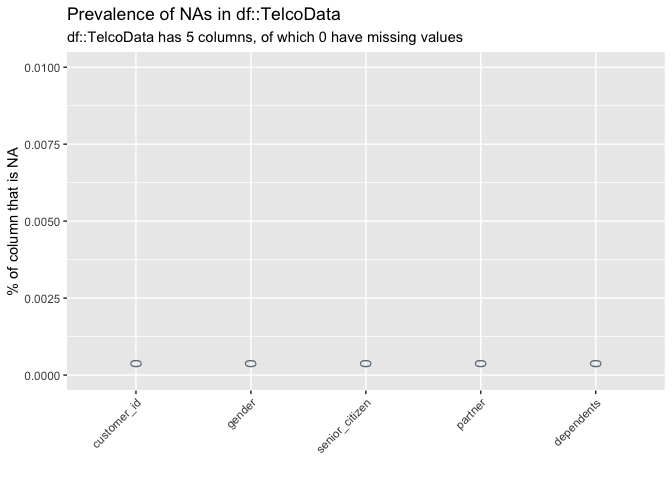<!-- -->

``` r
TelcoData %>% 
  dplyr::select(customer_id:dependents) %>% 
  inspectdf::inspect_num(df1 = .) %>% 
  inspectdf::show_plot(text_labels = TRUE)
```

    #>  [1] 1

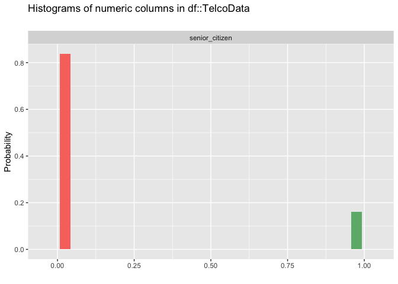<!-- -->

``` r
TelcoData %>% 
  dplyr::select(customer_id:dependents) %>% 
  inspectdf::inspect_cat(df1 = .) %>% 
  inspectdf::show_plot(text_labels = TRUE)
```

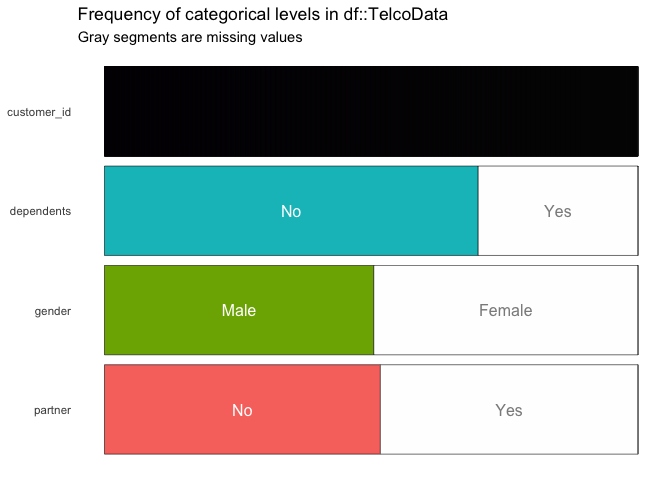<!-- -->

This shows us that the senior citizen variable is coded as `0` and `1`,
but should also have a categorical equivalent.

``` r
# call this _num
TelcoData <- TelcoData %>% 
  dplyr::rename(senior_citizen_num = senior_citizen)

# create categorical variable
TelcoData <- TelcoData %>% 
  dplyr::mutate(senior_citizen = case_when(
    senior_citizen_num == 1 ~ "Yes",
    senior_citizen_num == 0 ~ "No")) 
# put this in right place
TelcoData <- TelcoData %>% 
    dplyr::select(customer_id:gender,
                  dplyr::starts_with("senior"),
                  partner:churn) 
```

Check this just to verify.

``` r
# check the new variable
TelcoData %>% 
  dplyr::count(senior_citizen_num, senior_citizen) %>% 
  tidyr::spread(senior_citizen, n)
```

    #>  # A tibble: 2 x 3
    #>    senior_citizen_num    No   Yes
    #>                 <dbl> <int> <int>
    #>  1                  0  5901    NA
    #>  2                  1    NA  1142

Ok we’re looking better.

``` r
TelcoData %>% 
  dplyr::select(customer_id:dependents) %>% 
  inspectdf::inspect_cat(df1 = .) %>% 
  inspectdf::show_plot(text_labels = TRUE)
```

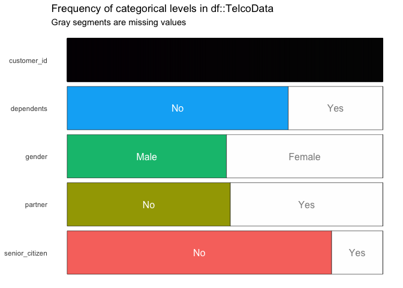<!-- -->

Now we see very few of them are senior citizens.

### Variables on the customer’s relationship to our products & services:

Our customer’s relationship to our products/services is captured in the
nine items below in this data set.

`phone_service` - Did they purchase phone service?

`multiple_lines` - Did they purchase multiple lines?

`internet_service` - Did they purchase internet services?

`online_security` - Did they purchase online security

`online_backup` - Did they purchase online backup?

`device_protection` - Did they purchase device protection?

`tech_support` - Did they purchase tech support?

`streaming_tv` - Did they purchase streaming TV?

`streaming_movies` - Did they purchase streaming movies?

The `tenure` column is capturing the length of time each customer has
had a relationship with our products/services.

#### Descriptive statistics of the product/service variables

The `skimr::skim()` gives us a breakdown of the counts, missing, min,
max, mean, sd, and other relevant statistics on this data frame.

``` r
TelcoData %>%
  dplyr::select(tenure:streaming_movies) %>%
  skimr::skim()
```

    #>  Skim summary statistics
    #>   n obs: 7043 
    #>   n variables: 10 
    #>  
    #>  ── Variable type:character ─────────────────────────────────────────────────────
    #>            variable missing complete    n min max empty n_unique
    #>   device_protection       0     7043 7043   2  19     0        3
    #>    internet_service       0     7043 7043   2  11     0        3
    #>      multiple_lines       0     7043 7043   2  16     0        3
    #>       online_backup       0     7043 7043   2  19     0        3
    #>     online_security       0     7043 7043   2  19     0        3
    #>       phone_service       0     7043 7043   2   3     0        2
    #>    streaming_movies       0     7043 7043   2  19     0        3
    #>        streaming_tv       0     7043 7043   2  19     0        3
    #>        tech_support       0     7043 7043   2  19     0        3
    #>  
    #>  ── Variable type:numeric ───────────────────────────────────────────────────────
    #>   variable missing complete    n  mean    sd p0 p25 p50 p75 p100     hist
    #>     tenure       0     7043 7043 32.37 24.56  0   9  29  55   72 ▇▃▃▂▂▃▃▅

#### Missing product/service data

``` r
# missing data 
TelcoData %>% 
  dplyr::select(tenure:streaming_movies) %>% 
  inspectdf::inspect_na(df1 = .) %>% 
  inspectdf::show_plot()
```

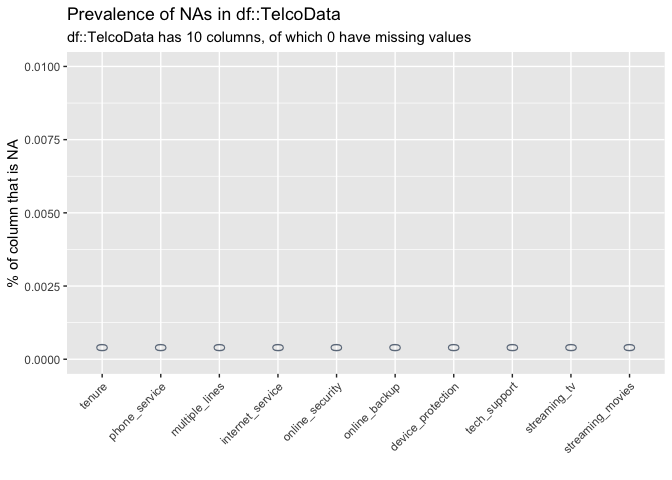<!-- -->

#### Numerical product/service data

`tenure` - how long have they been a customer?

``` r
TelcoData %>% 
  dplyr::select(tenure:streaming_movies) %>% 
  inspectdf::inspect_num(df1 = .) %>% 
  inspectdf::show_plot(text_labels = TRUE)
```

    #>  [1] 1

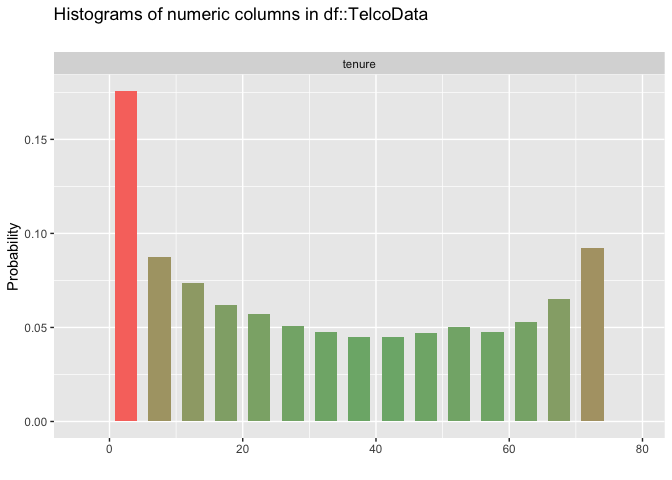<!-- -->

#### Categorical product/service variables

These are the nine categorical variables from the services we provide.

``` r
TelcoData %>% 
  dplyr::select(tenure:streaming_movies) %>% 
  inspectdf::inspect_cat(df1 = .) %>% 
  inspectdf::show_plot(text_labels = TRUE)
```

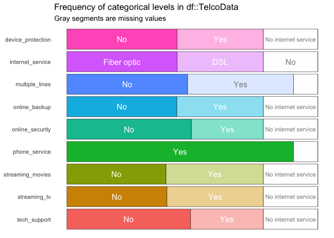<!-- -->

### Things we know about the customer’s :

These columns tell us about how the customer has been paying us.

``` r
TelcoData %>% 
  dplyr::select(contract:total_charges) %>% 
  skimr::skim()
```

    #>  Skim summary statistics
    #>   n obs: 7043 
    #>   n variables: 5 
    #>  
    #>  ── Variable type:character ─────────────────────────────────────────────────────
    #>            variable missing complete    n min max empty n_unique
    #>            contract       0     7043 7043   8  14     0        3
    #>   paperless_billing       0     7043 7043   2   3     0        2
    #>      payment_method       0     7043 7043  12  25     0        4
    #>  
    #>  ── Variable type:numeric ───────────────────────────────────────────────────────
    #>          variable missing complete    n    mean      sd    p0    p25
    #>   monthly_charges       0     7043 7043   64.76   30.09 18.25  35.5 
    #>     total_charges      11     7032 7043 2283.3  2266.77 18.8  401.45
    #>       p50     p75    p100     hist
    #>     70.35   89.85  118.75 ▇▁▃▂▆▅▅▂
    #>   1397.47 3794.74 8684.8  ▇▃▂▂▁▁▁▁

Missing billing data

``` r
TelcoData %>% 
  dplyr::select(contract:total_charges) %>% 
  inspectdf::inspect_na(df1 = .) %>% 
  inspectdf::show_plot(text_labels = TRUE)
```

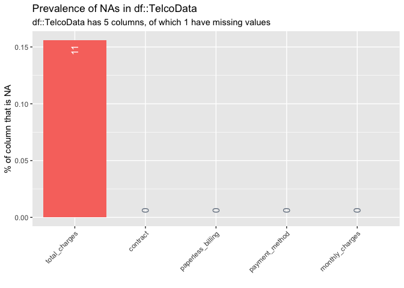<!-- -->

### Drop missing variables

We should remove the missing variables from the `total_charges` data
frame.

``` r
TelcoData <- TelcoData %>% tidyr::drop_na()

# recheck
TelcoData %>% 
  dplyr::select(contract:total_charges) %>% 
  inspectdf::inspect_na(df1 = .) %>% 
  inspectdf::show_plot(text_labels = TRUE)
```

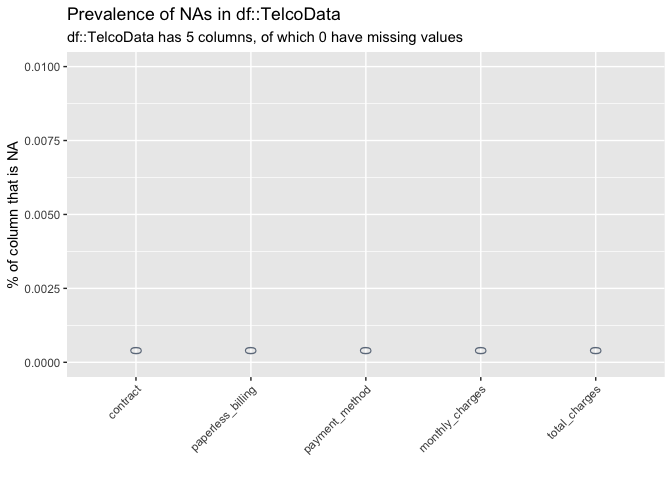<!-- -->

Numeric billing data

``` r
TelcoData %>% 
  dplyr::select(contract:total_charges) %>% 
  inspectdf::inspect_num(df1 = .) %>% 
  inspectdf::show_plot(text_labels = TRUE)
```

    #>  [1] 1
    #>  [1] 2

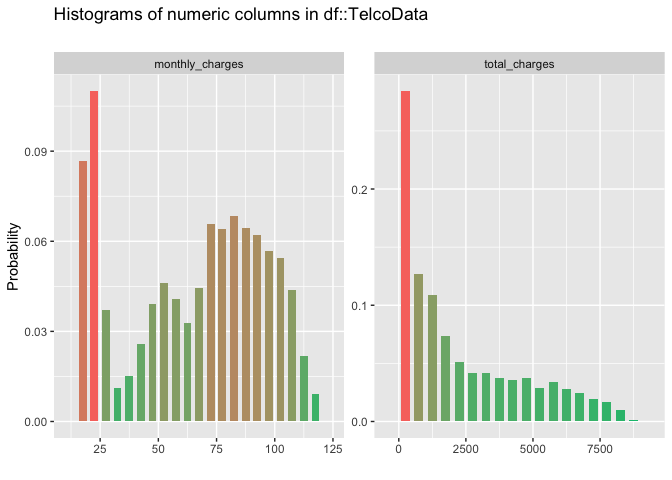<!-- -->

Categorical missing data from the billing variables.

``` r
TelcoData %>% 
  dplyr::select(contract:total_charges) %>% 
  inspectdf::inspect_cat(df1 = .) %>% 
  inspectdf::show_plot(text_labels = TRUE)
```

<!-- -->

We can see the three most common categories for these variables.

### These are things we can’t directly effect

These are variables that we can’t change easily, *and* changing them
wouldn’t reliably result in adding value to our existing customers. We
want to keep our eyes on minimal changes we can implement that result in
adding value to our existing customers.

`contract` - What is their contract?

`paperless_billing` - Do they have paperless billing?

`payment_method` - What is their payment method?

``` r
TelcoData %>% 
  dplyr::select(contract:payment_method) %>% 
  skimr::skim_to_wide()
```

    #>  # A tibble: 3 x 9
    #>    type      variable          missing complete n     min   max   empty
    #>    <chr>     <chr>             <chr>   <chr>    <chr> <chr> <chr> <chr>
    #>  1 character contract          0       7032     7032  8     14    0    
    #>  2 character paperless_billing 0       7032     7032  2     3     0    
    #>  3 character payment_method    0       7032     7032  12    25    0    
    #>    n_unique
    #>    <chr>   
    #>  1 3       
    #>  2 2       
    #>  3 4

Below are the missing data from the payment variables.

``` r
# missing data 
TelcoData %>% 
  dplyr::select(contract:payment_method) %>% 
  inspectdf::inspect_na(df1 = .) %>% 
  inspectdf::show_plot()
```

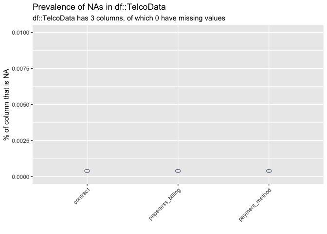<!-- -->

These are the categorical variables in the data frame.

``` r
TelcoData %>% 
  dplyr::select(contract:payment_method) %>% 
  inspectdf::inspect_cat(df1 = .) %>% 
  inspectdf::show_plot(text_labels = TRUE)
```

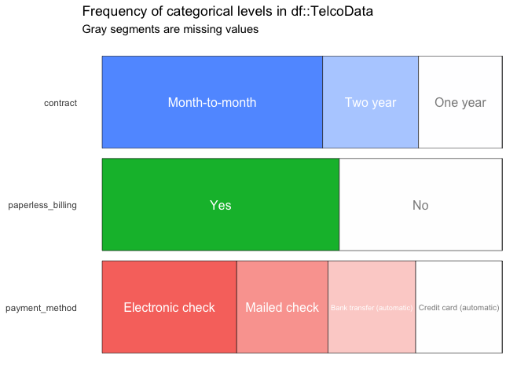<!-- -->

### The thing we are trying to predict:

The variables we want to change the dial on (i.e. outcomes) are the
metrics attached to revenue. **Always think of outcomes in terms of
dollars**.

`monthly_charges` - What are the monthly charges?

`total_charges` - What are the total charges up to this point?

`churn` - Did they customer stay/leave?

``` r
TelcoData %>% 
  dplyr::select(monthly_charges:churn) %>% 
  skimr::skim_to_wide()
```

    #>  # A tibble: 3 x 17
    #>    type   variable   missing complete n     min   max   empty n_unique mean 
    #>    <chr>  <chr>      <chr>   <chr>    <chr> <chr> <chr> <chr> <chr>    <chr>
    #>  1 chara… churn      0       7032     7032  2     3     0     2        <NA> 
    #>  2 numer… monthly_c… 0       7032     7032  <NA>  <NA>  <NA>  <NA>     "  6…
    #>  3 numer… total_cha… 0       7032     7032  <NA>  <NA>  <NA>  <NA>     2283…
    #>    sd        p0      p25      p50       p75       p100      hist    
    #>    <chr>     <chr>   <chr>    <chr>     <chr>     <chr>     <chr>   
    #>  1 <NA>      <NA>    <NA>     <NA>      <NA>      <NA>      <NA>    
    #>  2 "  30.09" 18.25   " 35.59" "  70.35" "  89.86" " 118.75" ▇▁▃▂▆▅▅▂
    #>  3 2266.77   "18.8 " 401.45   1397.47   3794.74   "8684.8 " ▇▃▂▂▁▁▁▁

Below are the missing data from the

``` r
# missing data 
TelcoData %>% 
  dplyr::select(monthly_charges:churn) %>% 
  inspectdf::inspect_na(df1 = .) %>% 
  inspectdf::show_plot()
```

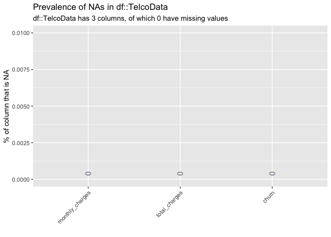<!-- -->

``` r
TelcoData %>% 
  dplyr::select(monthly_charges:churn) %>% 
  inspectdf::inspect_num(df1 = .) %>% 
  inspectdf::show_plot(text_labels = TRUE)
```

    #>  [1] 1
    #>  [1] 2

<!-- -->

``` r
TelcoData %>% 
  dplyr::select(monthly_charges:churn) %>% 
  inspectdf::inspect_cat(df1 = .) %>% 
  inspectdf::show_plot(text_labels = TRUE)
```

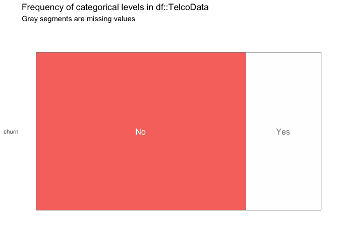<!-- -->

Here we can see the `churn` is a `character` variable, and indicates if
the customer stayed (`Yes`) or left (`No`). Before we can make any
calculations with churn, we’ll need to convert it to a numerical
variable.

``` r
TelcoData <- TelcoData %>% 
  dplyr::mutate(churn_num = dplyr::case_when(
    churn == "Yes" ~ 1, 
    churn == "No" ~ 0))
# check
TelcoData %>% 
  count(churn, churn_num) %>% 
  spread(churn, n)
```

    #>  # A tibble: 2 x 3
    #>    churn_num    No   Yes
    #>        <dbl> <int> <int>
    #>  1         0  5163    NA
    #>  2         1    NA  1869

We can use this new `churn_num` variable to capture how much each
category costs in terms of dollar amounts.

### Data inspection

Now we want to get a feel for how much data we have on each variable.
Examining the data as a whole will give us an overview of the
complete/missing data in each of the categories we outlined above.

We can see tenure is largest below 20 months (the giant red bar). This
tells us something. We should ask ourselves, “*how can I capture this
relationship in the data frame?*”

We can get the total percent and number of customers who churned.

``` r
# churn rate total format
TotalChurn <- TelcoData %>%
  dplyr::group_by(churn_num) %>%
  dplyr::summarize(`total churn` = n()) %>%
  dplyr::mutate(`churn percent` = `total churn` / sum(`total churn`))
TotalChurn
```

    #>  # A tibble: 2 x 3
    #>    churn_num `total churn` `churn percent`
    #>        <dbl>         <int>           <dbl>
    #>  1         0          5163           0.734
    #>  2         1          1869           0.266

``` r
ChurnXTenure <- TelcoDataRaw %>%
  # find all customers who churned
  filter(Churn == "Yes") %>% 
  # get a count of each number of months a customer has been with our company
  group_by(tenure) %>% 
  # add this number to the data set
  mutate(no_tenure = n()) %>%
  # 
  arrange(desc(no_tenure))
ChurnXTenure %>% head()
```

    #>  # A tibble: 6 x 22
    #>  # Groups:   tenure [1]
    #>    customerID gender SeniorCitizen Partner Dependents tenure PhoneService
    #>    <chr>      <chr>          <dbl> <chr>   <chr>       <dbl> <chr>       
    #>  1 8779-QRDMV Male               1 No      No              1 No          
    #>  2 1066-JKSGK Male               0 No      No              1 Yes         
    #>  3 8665-UTDHZ Male               0 Yes     Yes             1 No          
    #>  4 5919-TMRGD Female             0 No      Yes             1 Yes         
    #>  5 3091-FYHKI Male               0 No      No              1 No          
    #>  6 0390-DCFDQ Female             1 Yes     No              1 Yes         
    #>    MultipleLines InternetService OnlineSecurity OnlineBackup
    #>    <chr>         <chr>           <chr>          <chr>       
    #>  1 No phone ser… DSL             No             No          
    #>  2 No            No              No internet s… No internet…
    #>  3 No phone ser… DSL             No             Yes         
    #>  4 No            Fiber optic     No             No          
    #>  5 No phone ser… DSL             No             No          
    #>  6 No            Fiber optic     No             No          
    #>  # … with 11 more variables: DeviceProtection <chr>, TechSupport <chr>,
    #>  #   StreamingTV <chr>, StreamingMovies <chr>, Contract <chr>,
    #>  #   PaperlessBilling <chr>, PaymentMethod <chr>, MonthlyCharges <dbl>,
    #>  #   TotalCharges <dbl>, Churn <chr>, no_tenure <int>

Below we can see the distribution of the numerical variables in the
`TelcoDataRaw` dataset.

``` r
inspectdf::inspect_num(df1 = TelcoDataRaw) %>% 
  inspectdf::show_plot(text_labels = TRUE)
```

    #>  [1] 1
    #>  [1] 2
    #>  [1] 3
    #>  [1] 4

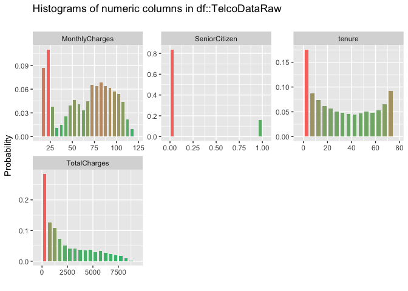<!-- -->

Here we see the `SeniorCitizen` variable is coded numerically (`0` = No,
`1` = Yes), so this should be reformatted and displayed in the plot
above.

## Wrangle

We know we have two variables that need to be reformatted (`customerID`
and `SeniorCitizen`). We will address this in the code below

``` r
TelcoData <- TelcoDataRaw %>% 
  dplyr::mutate(customerID = as.factor(customerID), 
                       SeniorCitizen = case_when(
                         SeniorCitizen == 1 ~ "Yes", 
                         SeniorCitizen == 0 ~ "No",
                         TRUE ~ NA_character_))
# re-graph
inspectdf::inspect_cat(df1 = TelcoData) %>% 
  inspectdf::show_plot(text_labels = TRUE) 
```

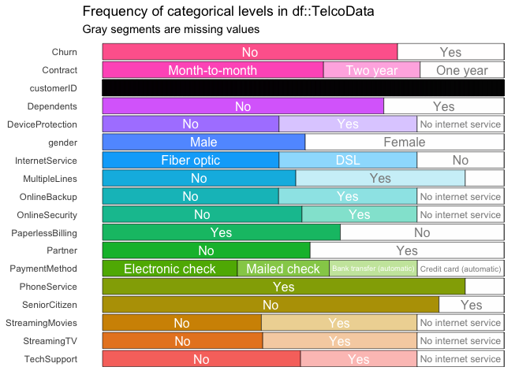<!-- -->

Now we can recheck the numerical variables.

``` r
inspectdf::inspect_num(df1 = TelcoData) %>% 
  inspectdf::show_plot(text_labels = TRUE)
```

    #>  [1] 1
    #>  [1] 2
    #>  [1] 3

<!-- -->

## Tidy

Do the number of rows equal the number of unique customers? Or are there
duplicates? This code tells us if the number of unique `customerID`s is
identical to the number of rows in `TelcoData`.

``` r
base::identical(x = TelcoData %>% dplyr::distinct(customerID) %>% nrow(),
                y = TelcoData %>% nrow())
```

    #>  [1] TRUE

Good. This helps us understand what we have in terms of data per
customer.

### Get a case study

Identify a case to represent a customer’s experience in your dataset.

``` r
TelcoCaseStudy <- TelcoDataRaw %>% 
  dplyr::sample_n(size = 1)
TelcoCaseStudy
```

    #>  # A tibble: 1 x 21
    #>    customerID gender SeniorCitizen Partner Dependents tenure PhoneService
    #>    <chr>      <chr>          <dbl> <chr>   <chr>       <dbl> <chr>       
    #>  1 2957-JIRMN Female             1 No      No             62 Yes         
    #>    MultipleLines InternetService OnlineSecurity OnlineBackup
    #>    <chr>         <chr>           <chr>          <chr>       
    #>  1 Yes           Fiber optic     No             No          
    #>  # … with 10 more variables: DeviceProtection <chr>, TechSupport <chr>,
    #>  #   StreamingTV <chr>, StreamingMovies <chr>, Contract <chr>,
    #>  #   PaperlessBilling <chr>, PaymentMethod <chr>, MonthlyCharges <dbl>,
    #>  #   TotalCharges <dbl>, Churn <chr>

A single case study gives us a picture of how a customer moves through
the data set.

## Know your data

“The main thing is to keep the main thing the main thing.” -\> Nick
Saban

In any dataset, there are probably more variables than you’ll need to
address the question. It’s important to think about 1) *what did we
measure?* (i.e. unit of analysis?), 2) *who/what did we measure it on?*
(what attributes do we have on this unit of measurement?), 3) *what
attributes can we act on?* (is there anything in this dataset that can
effect and change the outcome?), 4) *what decisions will the new
information effect?* (e.g. will we run experiments, add/remove features
to our product, change marketing program, etc.), 5) and *who will be
using this information to make a decision?* (is this going to my CFO,
marketing manager, software engineer, etc.)

Here we have a case study, and this allows us to start telling the story
of what we’re seeing. The case study is the character in this story.

1.  This customer is a \[`gender`\], is/isn’t a senior citizen
    \[`SeniorCitizen`\], has/doesn’t have a partner \[`Partner`\],
    has/doesn’t have dependents \[`Dependents`\]

2.  They’ve paying for our products/services for 45 months  

3.  They have four services (DSL, online security, device protection,
    and tech support)

We know this case is an existing customer (`Churn` = `No`), and that
he’s paid `42.3` per month.

#### Know how things are measured

All of these questions are based on binary (`Yes`/`No`) responses to the
following services.

### Solve for case

Tidy these data for the case.

``` r
TelcoCaseStudy %>% 
  tidyr::gather(key = "service", 
                value = "purchase_status", 
                PhoneService:StreamingMovies) %>% 
  count(purchase_status)
```

    #>  # A tibble: 3 x 2
    #>    purchase_status     n
    #>    <chr>           <int>
    #>  1 Fiber optic         1
    #>  2 No                  5
    #>  3 Yes                 3

The `MonthlyCharges` and `TotalCharges` are likely summarized before
they ended up in this data set.

### Mutate

At this time, we don’t know if we can/should create any new columns
based on the data in the existing structure.

``` r
TelcoDataRaw %>%
  count(InternetService)
```

    #>  # A tibble: 3 x 2
    #>    InternetService     n
    #>    <chr>           <int>
    #>  1 DSL              2421
    #>  2 Fiber optic      3096
    #>  3 No               1526
